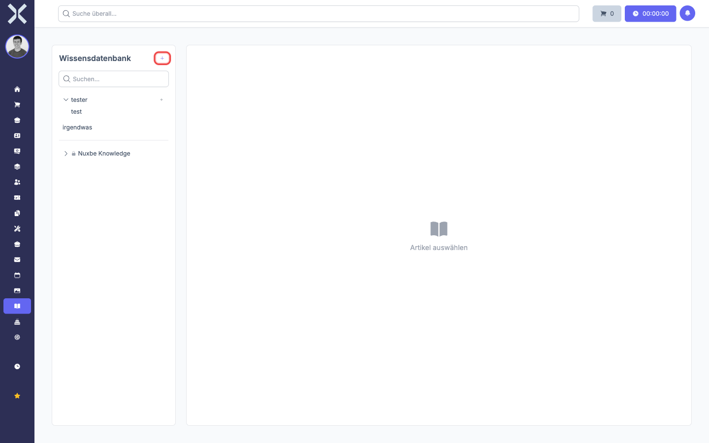
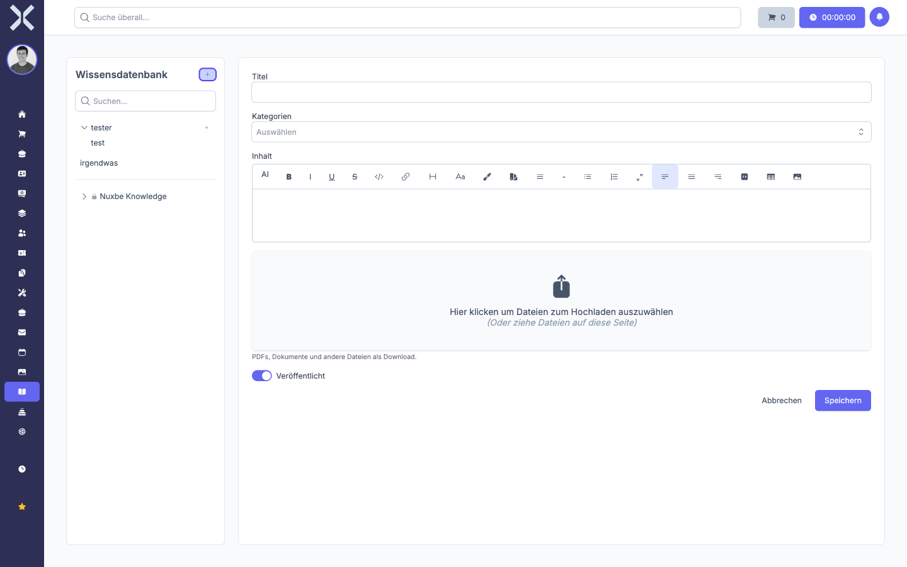
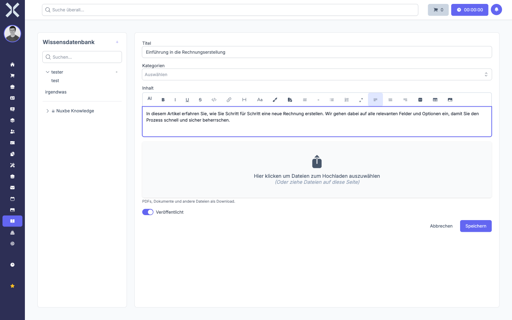
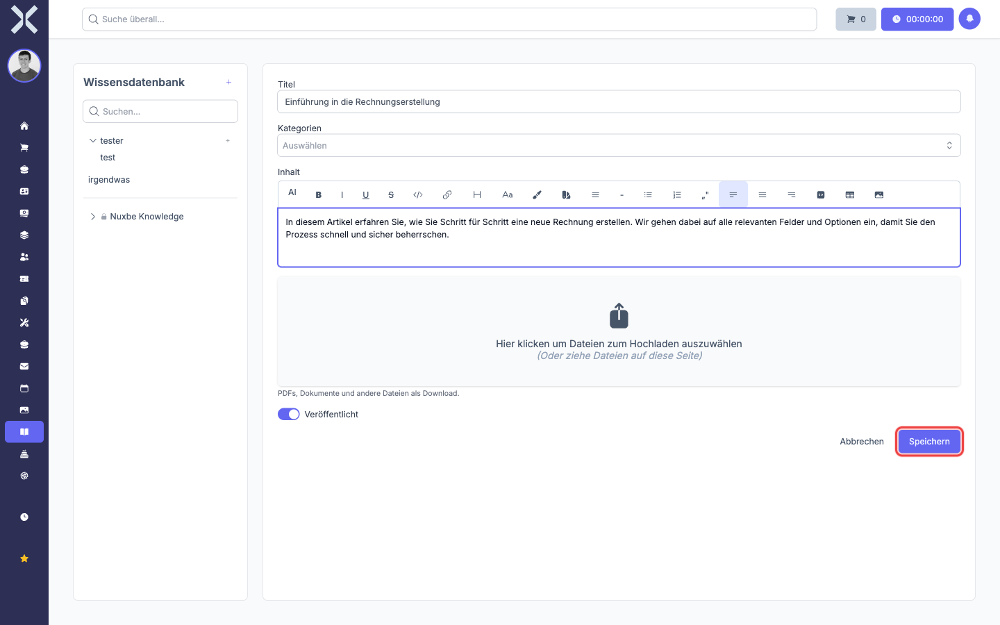

# Artikel erstellen

1. Klicken Sie auf die Schaltfläche **+** oben rechts neben der Überschrift **Wissensdatenbank**.

   

2. Es öffnet sich das Erstellungsformular mit folgenden Feldern:
   - **Titel**: Der Titel des Artikels.
   - **Kategorien**: Ordnen Sie den Artikel einer oder mehreren Kategorien zu.
   - **Inhalt**: Der eigentliche Artikeltext. Im Editor stehen Ihnen Formatierungsoptionen wie Fettschrift, Listen, Links, Tabellen und Bilder zur Verfügung.
   - **Dateianhänge**: Laden Sie PDFs, Dokumente oder andere Dateien hoch, die als Download zur Verfügung stehen sollen.
   - **Veröffentlicht**: Legt fest, ob der Artikel sichtbar ist.

   

3. Füllen Sie die Felder aus.

   

4. Klicken Sie auf **Speichern**.

   

Der Artikel wird gespeichert und in der Leseansicht angezeigt.

> **Hinweis:** Sie können einen Artikel auch direkt in einer bestimmten Kategorie erstellen. Klicken Sie dazu auf die Schaltfläche **+** neben dem Kategorienamen in der Sidebar.
