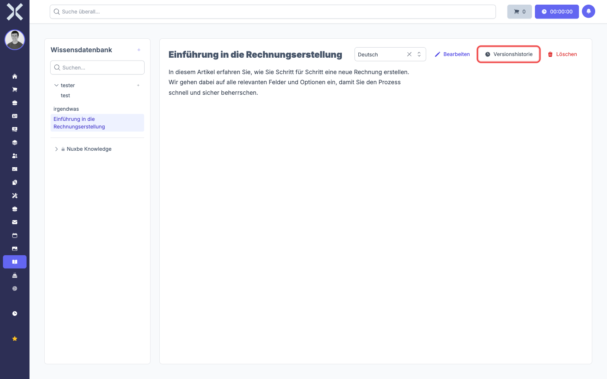
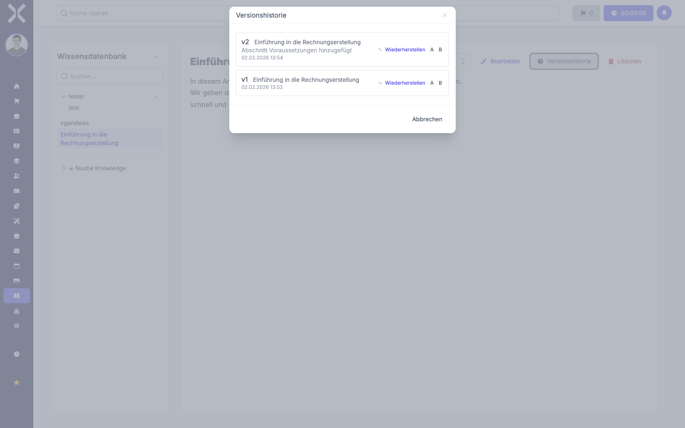
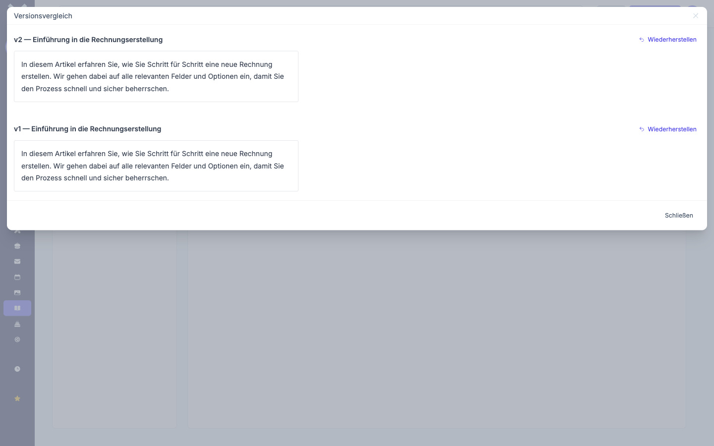

# Versionshistorie

Jede Speicherung eines Artikels erzeugt automatisch eine neue Version. So können Sie Änderungen nachvollziehen und bei Bedarf ältere Versionen wiederherstellen.

1. Wählen Sie einen Artikel aus und klicken Sie auf **Versionshistorie**.

   

2. Es öffnet sich ein Dialog mit allen gespeicherten Versionen. Zu jeder Version sehen Sie die Versionsnummer, den Titel, die Zusammenfassung und den Zeitpunkt der Änderung.

   

## Version wiederherstellen

Klicken Sie bei der gewünschten Version auf **Wiederherstellen**. Der Artikel wird mit dem Inhalt dieser Version im Bearbeitungsmodus geöffnet, sodass Sie ihn prüfen und speichern können.

## Versionen vergleichen

1. Klicken Sie bei der ersten Version auf **A** und bei der zweiten Version auf **B**.
2. Klicken Sie auf **Versionen vergleichen**.
3. Beide Versionen werden nebeneinander angezeigt. Auch hier können Sie jede Version über **Wiederherstellen** direkt zurückholen.

   
