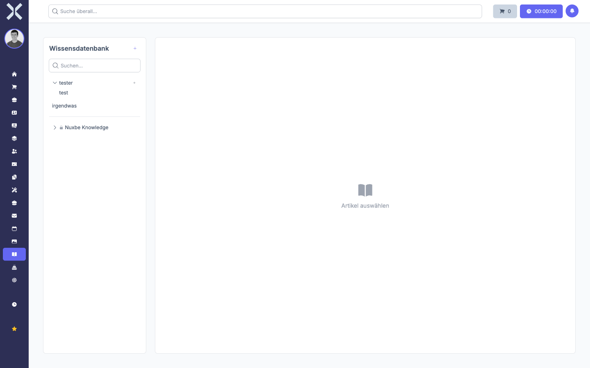

# Overview & Navigation

The Knowledge Base provides a central place to create, organize and share knowledge articles with your team. All articles are versioned, so changes can be tracked at any time.

Open the Knowledge Base via the **Wissensdatenbank** menu item in the left navigation bar.

The page is divided into two areas:

- **Left Sidebar**: Shows all categories, articles and package documentation. Use the search field to quickly find articles.
- **Right Content Area**: Displays the selected article or the editing form.

Click on an article title in the sidebar to view it.

## Search

Use the search field at the top of the sidebar to filter articles by title. Results are updated automatically as you type.

## Language Selection

Use the dropdown in the article view to switch languages. Articles can be maintained in multiple languages. Select the desired language to view or edit the corresponding translation.
