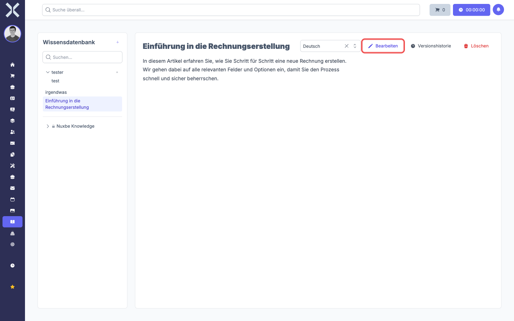
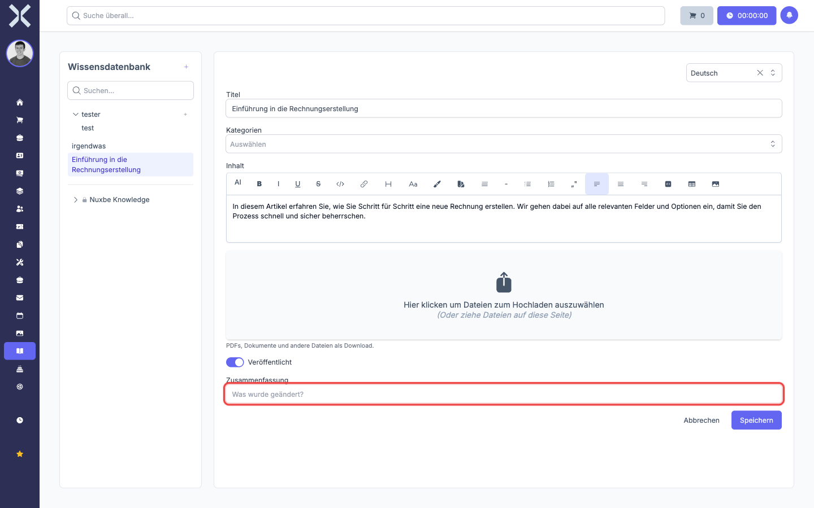

# Editing an Article

1. Select the desired article in the sidebar.

2. Click **Bearbeiten** (Edit).

   

3. Make your changes. When editing an existing article, an additional **Zusammenfassung** (Change Summary) field appears. Enter what you changed. This information is stored in the version history.

   

4. Click **Speichern** (Save) to apply the changes, or **Abbrechen** (Cancel) to leave the edit mode.

## Deleting an Article

1. Select the article in the sidebar.
2. Click **Löschen** (Delete, shown in red).
3. Confirm the action in the confirmation dialog.
